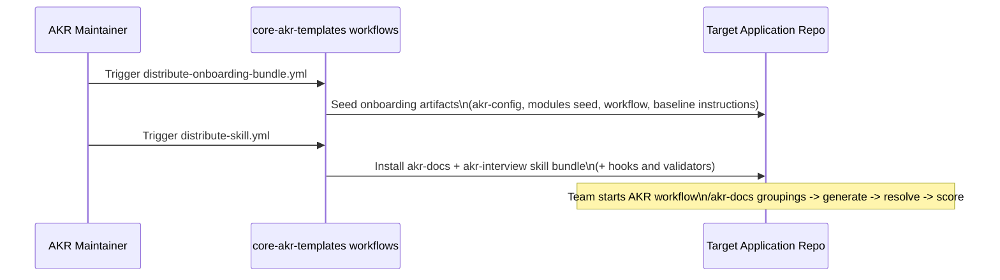

# AKR Proposed Architecture, Onboarding Flow, and Skills Inventory

## 1. Proposed AKR Architecture (Core + Application + Consolidation)

```mermaid
flowchart LR
    subgraph CORE[core-akr-templates repo]
        C1[.github/skills\nakr-docs\nakr-interview\nakr-business-consolidation]
        C2[examples/onboarding\nseed files]
        C3[.github/workflows\ndistribute-skill.yml\ndistribute-business-skill.yml\ndistribute-onboarding-bundle.yml]
        C4[.akr standards\nvalidation\ncharters\ntemplates]
    end

    subgraph APP[Application codebase repo(s)]
        A1[training-tracker-backend\nor other app repo]
        A2[.github/skills/akr-docs\n.github/skills/akr-interview]
        A3[modules.yaml + module docs\nlocal CI validation]
    end

    subgraph CONSOLIDATION[Business consolidation repo(s)]
        B1[business consolidation repo]
        B2[.github/skills/akr-business-consolidation]
        B3[docs/business-capabilities/*]
    end

    C3 -- distribute-skill.yml --> A2
    C3 -- distribute-onboarding-bundle.yml --> A1
    C4 -- runtime standards + rules --> A3

    C3 -- distribute-business-skill.yml --> B2
    C4 -- business governance contracts --> B3

    A3 -- module outputs + traceability --> B3
    B3 -- capability feedback and coverage gaps --> A3
```

### Architecture intent

- `core-akr-templates` remains the source of truth for standards, templates, and skill definitions.
- Application repositories run module-level documentation and unknown resolution close to source code.
- Consolidation repositories aggregate cross-repo outputs into business capability documentation.

## 2. Onboarding Distribution Flow (Simple)



### What gets distributed during onboarding and follow-up

- Onboarding bundle seeds baseline repo scaffolding needed to start AKR adoption.
- Skill bundle distribution is a separate lifecycle step and installs `akr-docs` and `akr-interview` for application repositories.
- Consolidation repositories are handled by a separate workflow that installs `akr-business-consolidation`.

## 3. Proposed Consolidation Repository Folder Structure

The following structure reflects the target business-capability layout used by the consolidation workflow.

```text
<consolidation-repo>/
    .github/
        skills/
            akr-business-consolidation/
                SKILL.md
                SKILL-COMPAT.md
                scripts/
                    capability-impact-analysis.md
                    capability-coverage-review.md
                    capability-consolidation.md
                    capability-promote.md
                    capability-test-maintenance.md
                    capability-test-generation.md
                    capability-relationship-mapping.md
        copilot-instructions.md
    docs/
        business-capabilities/
            <CapabilityName>/
                index.md
                test-conditions.md
                enhancement-test-conditions.md
                enhancements.md
                limitations.md
                internal_dependencies.md
                external_dependencies.md
                traceability.md
```

Notes:

- Capability folders are the primary consolidation output boundary.
- `copilot-instructions.md` is preserved if already present and only seeded when missing.

## 4. New Folders Created in Application Repositories During Onboarding

The onboarding and follow-up skill distribution process creates these folders in target application repositories (when absent):

```text
<application-repo>/
    .github/
        pull_request_template/
            documentation.md
        workflows/
            validate-documentation.yml
        skills/
            akr-docs/
                SKILL.md
                SKILL-COMPAT.md
                scripts/
                    akr-groupings.md
                    akr-generate.md
                    akr-resolve.md
                    akr-refresh-assets.md
                    akr-cache.md
                    akr-score.md
                    akr_inline_validate.py
                    validate_documentation.py
            akr-interview/
                SKILL.md
                scripts/
                    akr-interview.md
        hooks/
            postToolUse.json
            agentStop.json
```

Related file seeding during onboarding (not folders):

- `modules.yaml`
- `.akr-config.json`
- `.github/CODEOWNERS` (AKR governance block appended if missing)
- `.github/copilot-instructions.md` (seeded only when missing)

## 5. Current Skills Inventory and Purpose by Repo Type

The following are the currently available AKR skills in this repository:

- `akr-docs`
- `akr-interview`
- `akr-business-consolidation`

| Skill | Primary command surface | Purpose in core-akr-templates repo | Purpose in application codebase repos | Purpose in consolidation repos |
|---|---|---|---|---|
| `akr-docs` | `/akr-docs groupings|generate|resolve|refresh-assets|score|cache-status|update-cache` | Authored and versioned as source-of-truth dispatcher and mode scripts; distributed via `distribute-skill.yml`. | Primary skill for module documentation lifecycle: grouping, draft generation, unknown resolution prep, cache maintenance, and scoring. | Not distributed by the business-skill workflow; not the primary operating skill in this lane. |
| `akr-interview` | `/akr-interview [file] [--as @username] [--callouts-only]` | Authored and versioned as source-of-truth interview workflow; distributed with app skill bundle. | Interactive closure of unresolved markers and `@username` callouts in module documents. | Not distributed by the business-skill workflow. |
| `akr-business-consolidation` | `/akr-business-consolidation capability-impact-analysis|capability-coverage-review|capability-consolidation|capability-promote|capability-test-maintenance|capability-test-generation|capability-relationship-mapping` | Authored and versioned as source-of-truth consolidation workflow; distributed via `distribute-business-skill.yml`. | Excluded by design from application skill distribution. | Primary skill for business capability synthesis, promotion, test governance, and cross-layer relationship mapping. |

## 6. Repo-Type Summary

- Core standards repo type (`core-akr-templates`): owns all skill definitions, scripts, and release distribution workflows.
- Application codebase repo type: receives and runs `akr-docs` and `akr-interview`.
- Consolidation repo type: receives and runs `akr-business-consolidation`.
