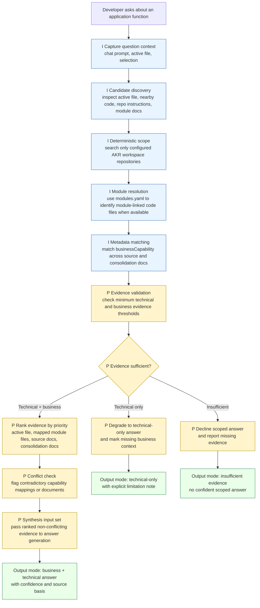

# Copilot Scoped Retrieval Pipeline in AKR

Date: 2026-04-19
Status: POC pilot retrieval specification
Purpose: Define the retrieval path, minimum evidence rules, and degradation behavior for Copilot responses in an AKR workspace instead of describing a generic global repository scan.

## Diagram

Legend:

- `I` = retrieval signals available in the current AKR workspace model.
- `P` = pilot behavior that must be implemented or enforced for reliable scoped retrieval.

## Key AKR Scoping Rules

1. Candidate discovery begins from the developer question, active editor context, repo instructions, and AKR documentation artifacts.
2. Retrieval scope is limited to the configured AKR workspace repositories participating in the current question, not an arbitrary set of opened folders.
3. `modules.yaml` is the primary technical mapping source for module-linked code retrieval when present.
4. `businessCapability` is the semantic key used to match related documentation across source and consolidation repositories.
5. Source module docs provide technical and module-level context; consolidation docs provide business-level context.
6. Retrieval must follow a defined order: candidate discovery -> scope restriction -> module resolution -> metadata matching -> evidence validation -> ranking -> conflict check -> synthesis.

## Retrieval Contract Summary

- Input signal: developer question + editor context.
- Scope boundary: configured AKR workspace repositories only.
- AKR signal: `businessCapability` metadata used across module and consolidation documents.
- Technical corpus: code and module-linked files identified through `modules.yaml` or active-file adjacency.
- Business corpus: capability-aligned docs from source and consolidation repositories.
- Retrieval order: candidate discovery -> scope restriction -> module resolution -> metadata matching -> evidence validation -> ranking -> conflict check -> synthesis.

## Minimum Evidence Rules

Copilot should not treat all retrieved evidence as equally sufficient.

- Minimum technical evidence: one of the following must exist:
  - active file or selected code directly related to the asked function
  - module-linked code files resolved through `modules.yaml`
  - source module documentation tied to the same module
- Minimum business evidence for a full scoped answer: at least one capability-aligned business artifact from the consolidation repository or source documentation with explicit `businessCapability` metadata.
- If technical evidence exists but business evidence does not, answer may proceed in technical-only mode.
- If technical evidence is missing or too weak to identify the function path, Copilot should not present a confident scoped answer.

## Degradation And Failure Modes

- `Business context missing`: provide a technical-only answer and explicitly state that consolidation/business evidence was not found.
- `Technical context missing`: do not provide a confident scoped explanation of function behavior.
- `Conflicting capability mappings`: flag the inconsistency and avoid merging contradictory evidence into one answer.
- `Partial metadata coverage`: continue only with the evidence that can be traced to the selected module or capability.

## Evidence Ranking Order

When multiple matching artifacts exist, evidence should be weighted in this order:

1. Active file and current editor selection.
2. Code files linked to the module through `modules.yaml`.
3. Source module documentation for the same module.
4. Consolidation repository capability documents with matching `businessCapability`.
5. General repo instructions and supporting AKR reference documents.

## Conflict Handling

- If the same module maps to different `businessCapability` values across repositories, do not silently merge both paths.
- If source and consolidation documents disagree on capability meaning or behavior, prefer direct module-linked technical evidence for function behavior and report the business-context mismatch.
- If multiple capability matches are found with no deterministic module tie, classify the result as ambiguous rather than authoritative.

## Current POC Boundary

- Implemented/reliably available today: AKR metadata conventions, `modules.yaml`-based module grouping, `businessCapability` tagging model, source and consolidation document structure.
- Not yet guaranteed today: deterministic evidence validation, conflict resolution, confidence gating, and decline-to-answer behavior.
- This document therefore defines the pilot retrieval behavior that should be enforced before management treats scoped retrieval as a dependable capability.

